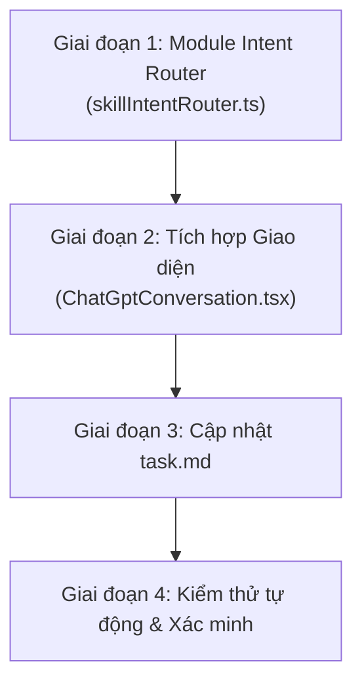

# Kế Hoạch Triển Khai: Chuyển Đổi ChatCMD Sang Cơ Chế Find Skill (Intent Router)

## 1. Mục Tiêu
Chuyển đổi luồng xử lý kỹ năng trong ChatCMD từ cơ chế tĩnh **Skill List** (nạp toàn bộ 147 skill thô gây quá tải ~7.000 tokens) sang cơ chế động **Find Skill theo Ý Định (Intent Skill Router)**:
- Tự động phân tích từ khóa và ngữ cảnh trong prompt của người dùng.
- Lọc ra Top 1 đến 3 kỹ năng phù hợp nhất từ 147 skills hiện có.
- Chỉ đính kèm các kỹ năng tinh gọn này vào prompt gửi sang ChatGPT (tiết kiệm >95% token).
- Hiển thị trực quan các kỹ năng được tìm thấy trên giao diện người dùng.

---

## 2. Các Giai Đoạn Triển Khai

### Giai đoạn 1: Xây dựng Module `skillIntentRouter.ts`
- Đường dẫn: `C:\Tools\ChatCmd\web\src\chatgpt\skillIntentRouter.ts`
- Nhiệm vụ:
  + Tách từ khóa loại bỏ stop-words (tiếng Việt & tiếng Anh).
  + Chấm điểm khớp giữa prompt và metadata (name, description) của từng skill.
  + Trả về Top 3 skills phù hợp nhất kèm mô tả súc tích.

### Giai đoạn 2: Tích hợp vào Giao Diện `ChatGptConversation.tsx`
- Đường dẫn: `C:\Tools\ChatCmd\web\src\chatgpt\ChatGptConversation.tsx`
- Nhiệm vụ:
  + Nạp danh sách kỹ năng qua `api.skills()`.
  + Tự động tính toán `matchedSkills` khi người dùng gõ nội dung vào ô chat.
  + Hiển thị huy hiệu (badges) các kỹ năng được gợi ý ngay trên UI.
  + Cập nhật hàm `selectedPrompt` để chỉ gửi các kỹ năng được chọn sang ChatGPT.

### Giai đoạn 3: Cập nhật `task.md`
- Đường dẫn: `C:\Tools\ChatCmd\task.md`
- Thêm Task 7 vào danh sách công việc và đánh dấu tiến độ thực hiện.

### Giai đoạn 4: Kiểm thử tự động & Xác thực
- Tạo kịch bản kiểm tra `C:\Tools\kiem_tra_skill_intent_router.ps1`.
- Kiểm thử các ca prompt: bảo mật, thiết kế UI, dịch ngược, cơ sở dữ liệu.
